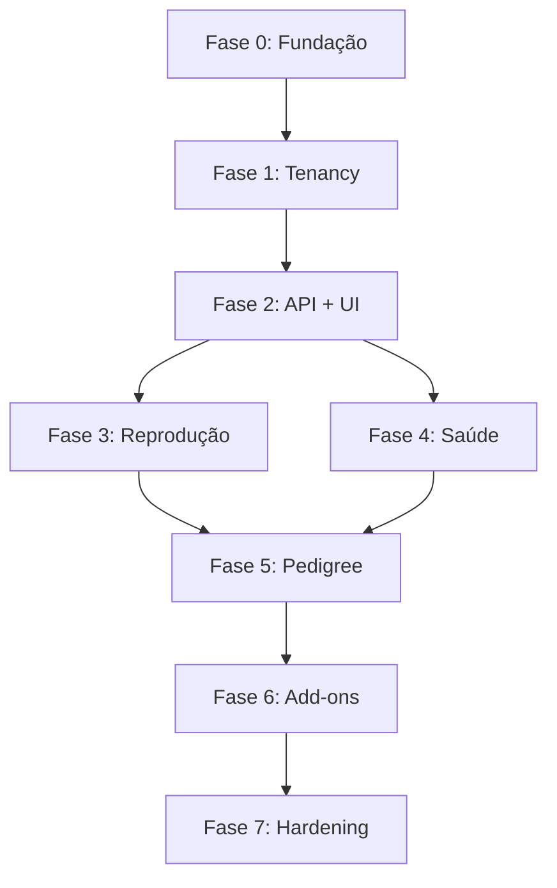

# ROADMAP.md - Plano de Implementação por Fases

## Plugin WordPress para Gestão de Canil (SaaS Multi-tenant)

**Data:** 02/02/2026  
**Versão:** 1.0

---

## Visão Geral do Roadmap

Este documento detalha o plano de implementação em 7 fases principais, com entregáveis específicos, critérios de aceite e estimativas. Cada fase pode ser dividida em sprints menores conforme a capacidade da equipe.

```
┌─────────────────────────────────────────────────────────────────────────┐
│                          TIMELINE DO PROJETO                              │
├─────────────────────────────────────────────────────────────────────────┤
│ Fase 0      │ Fase 1    │ Fase 2      │ Fase 3    │ Fase 4    │ Fase 5 │
│ Fundação    │ Tenancy   │ API+UI Base │ Reprodução│ Saúde     │ Pedigr.│
│ 2 semanas   │ 2 semanas │ 4 semanas   │ 3 semanas │ 3 semanas │ 2 sem. │
├─────────────┴───────────┴─────────────┴───────────┴───────────┴────────┤
│                       │ Fase 6       │ Fase 7      │                    │
│                       │ Add-ons      │ Hardening   │   LANÇAMENTO       │
│                       │ 3 semanas    │ 2 semanas   │                    │
└─────────────────────────────────────────────────────────────────────────┘
```

**Total Estimado: ~21 semanas (5 meses)**

---

## FASE 0 — Fundação (2 semanas)

### Objetivo
Configurar a base do projeto: estrutura de diretórios, ambiente de desenvolvimento, CI/CD, e documentação inicial.

### Entregáveis

#### 0.1 Estrutura do Repositório
- [ ] Criar estrutura de diretórios conforme ARQUITETURA.md
- [ ] Configurar `.gitignore` adequado
- [ ] Criar arquivos iniciais do plugin core

#### 0.2 Plugin Skeleton
- [ ] Criar `plugin-core/canil-core.php` com header padrão WP
- [ ] Implementar hooks de activation/deactivation
- [ ] Criar autoloader (Composer ou próprio)
- [ ] Adicionar namespace principal

#### 0.3 Ambiente de Desenvolvimento
- [ ] Configurar Docker Compose ou wp-env
- [ ] Documentar passos de setup local
- [ ] Testar instalação limpa

#### 0.4 Configuração CI/CD
- [ ] GitHub Action para PHPCS lint
- [ ] GitHub Action para PHPUnit (estrutura inicial)
- [ ] GitHub Action para build JS
- [ ] Configurar branch protection no `main`

#### 0.5 Documentação Base
- [ ] Atualizar README.md com instruções
- [ ] Criar .github/copilot-instructions.md
- [ ] Criar templates de Issue e PR
- [ ] Documentar comandos de dev

### Definition of Done (DoD) Fase 0
- [ ] Plugin instala e ativa sem warnings
- [ ] CI passa em todos os jobs
- [ ] Ambiente local funciona para devs
- [ ] Documentação permite onboarding

### Tarefas Técnicas

```markdown
## Issue: [Fase 0] Setup inicial do plugin core

**Contexto:** Preparar a fundação do projeto

**Tarefas:**
1. Criar estrutura de diretórios
2. Criar canil-core.php com:
   - Plugin header
   - Activation hook
   - Deactivation hook
   - Autoloader básico
3. Configurar composer.json
4. Configurar package.json

**Critérios de Aceite:**
- [ ] Plugin ativa sem erros
- [ ] Autoload funciona
- [ ] Composer install sem erros
```

---

## FASE 1 — Tenancy + Modelo de Dados (2 semanas)

### Objetivo
Implementar a base multi-tenant, criar tabelas do banco de dados, definir roles/capabilities, e estabelecer a camada de acesso a dados com isolamento obrigatório.

### Entregáveis

#### 1.1 Sistema de Migrações
- [ ] Criar estrutura de migrações versionadas
- [ ] Implementar runner de migrações
- [ ] Criar option para controle de versão do DB

#### 1.2 Tabelas do Banco de Dados
- [ ] Migração: tabela `canil_dogs`
- [ ] Migração: tabela `canil_litters`
- [ ] Migração: tabela `canil_puppies`
- [ ] Migração: tabela `canil_people`
- [ ] Migração: tabela `canil_events`
- [ ] Migração: tabela `canil_audit_log`
- [ ] Índices em todas as tabelas (tenant_id, etc.)

#### 1.3 Camada Base de Repositórios
- [ ] Criar `BaseRepository` com tenant enforcement
- [ ] Implementar `TenantQuery` helper
- [ ] Criar exceções de domínio

#### 1.4 Roles e Capabilities
- [ ] Definir capabilities do plugin
- [ ] Criar role `kennel_owner`
- [ ] Registrar caps na ativação
- [ ] Remover caps na desativação

#### 1.5 Auditoria Básica
- [ ] Criar service de auditoria
- [ ] Logar operações críticas
- [ ] Garantir tenant isolation no audit

### Definition of Done (DoD) Fase 1
- [ ] Tabelas criadas com índices corretos
- [ ] Toda query filtra por tenant_id automaticamente
- [ ] Roles e caps funcionando
- [ ] Testes de isolamento passando (A não vê B)

### Tarefas Técnicas

```markdown
## Issue: [Fase 1.2] Criar tabela canil_dogs

**Contexto:** Tabela principal para armazenar cães do plantel

**Schema:**
- id (BIGINT, PK, AUTO_INCREMENT)
- tenant_id (BIGINT, FK wp_users.ID, INDEX)
- name (VARCHAR 255, NOT NULL)
- registration_number (VARCHAR 100, NULLABLE)
- chip_number (VARCHAR 50, NULLABLE)
- breed (VARCHAR 100, NOT NULL)
- color (VARCHAR 100)
- birth_date (DATE, NOT NULL)
- sex (ENUM: male, female)
- status (ENUM: active, breeding, retired, sold, deceased)
- sire_id (BIGINT, self-reference, NULLABLE)
- dam_id (BIGINT, self-reference, NULLABLE)
- photos (JSON)
- notes (TEXT)
- created_at (DATETIME)
- updated_at (DATETIME)

**Índices:**
- PRIMARY KEY (id)
- INDEX idx_tenant (tenant_id)
- INDEX idx_tenant_status (tenant_id, status)
- INDEX idx_tenant_sex (tenant_id, sex)

**Critérios de Aceite:**
- [ ] Migração cria tabela corretamente
- [ ] Rollback funciona
- [ ] Índices criados
```

```markdown
## Issue: [Fase 1.3] Implementar BaseRepository com tenant isolation

**Contexto:** Garantir que TODA query seja filtrada por tenant

**Regras SaaS:**
- tenant_id = get_current_user_id()
- NUNCA aceitar tenant_id do request
- Toda query deve incluir WHERE tenant_id = ?

**Implementação:**
```php
abstract class BaseRepository {
    protected function getTenantId(): int {
        $id = get_current_user_id();
        if ($id === 0) throw new UnauthorizedException();
        return $id;
    }
    
    protected function query(): TenantQuery {
        return (new TenantQuery($this->table))
            ->whereTenant($this->getTenantId());
    }
}
```

**Critérios de Aceite:**
- [ ] Impossível fazer query sem tenant
- [ ] Teste: user A não vê dados de user B
- [ ] Exception se não autenticado
```

---

## FASE 2 — REST API + Admin UI Base (4 semanas)

### Objetivo
Implementar CRUD completo via REST API para todas as entidades principais e criar a interface admin em React.

### Semana 2.1-2.2: REST API

#### 2.1 Controllers REST
- [ ] Implementar `DogsController` (CRUD completo)
- [ ] Implementar `LittersController` (CRUD completo)
- [ ] Implementar `PuppiesController` (CRUD completo)
- [ ] Implementar `PeopleController` (CRUD completo)
- [ ] Implementar `EventsController` (CRUD completo)

#### 2.2 Schemas e Validação
- [ ] Criar schemas JSON para cada entidade
- [ ] Implementar validação de request
- [ ] Sanitização de todos os inputs

#### 2.3 Paginação e Filtros
- [ ] Implementar paginação padrão
- [ ] Filtros por status, busca, data
- [ ] Ordenação configurável

### Semana 2.3-2.4: Admin UI (React)

#### 2.4 Setup React/Webpack
- [ ] Configurar build system
- [ ] Integrar com @wordpress/scripts
- [ ] Enqueue no wp-admin

#### 2.5 Componentes Base
- [ ] DataTable com paginação
- [ ] FormField components
- [ ] Modal/Dialog
- [ ] Notifications/Toasts
- [ ] Empty states
- [ ] Loading states

#### 2.6 Páginas CRUD
- [ ] Dashboard inicial
- [ ] Dogs: list + form (create/edit)
- [ ] Litters: list + form
- [ ] Puppies: list + form
- [ ] People: list + form
- [ ] Events: timeline view

### Definition of Done (DoD) Fase 2
- [ ] Todos endpoints REST funcionando
- [ ] Validação e sanitização em todas as rotas
- [ ] UI permite CRUD completo de todas entidades
- [ ] Filtros e paginação funcionando
- [ ] Testes de API passando

### Tarefas Técnicas

```markdown
## Issue: [Fase 2.1] Implementar DogsController REST

**Contexto:** CRUD completo de cães via REST API

**Rotas:**
- GET    /canil/v1/dogs         - Listar (paginado, filtros)
- POST   /canil/v1/dogs         - Criar
- GET    /canil/v1/dogs/{id}    - Obter
- PUT    /canil/v1/dogs/{id}    - Atualizar
- DELETE /canil/v1/dogs/{id}    - Excluir

**Regras SaaS:**
- Todas rotas exigem autenticação
- permission_callback: current_user_can('manage_dogs')
- tenant_id forçado do servidor

**Filtros (query params):**
- search (nome, chip, registro)
- status (active, breeding, etc)
- sex (male, female)
- page, per_page

**Response format:**
```json
{
  "data": [...],
  "meta": {
    "total": 50,
    "page": 1,
    "per_page": 20,
    "total_pages": 3
  }
}
```

**Critérios de Aceite:**
- [ ] Todas rotas funcionando
- [ ] Validação de schema em POST/PUT
- [ ] Paginação correta
- [ ] User A não vê dogs de User B
- [ ] 401 se não autenticado
- [ ] 403 se sem permissão
```

```markdown
## Issue: [Fase 2.6] Implementar página de listagem de Cães (React)

**Contexto:** UI para listar e gerenciar cães

**Funcionalidades:**
- Tabela com colunas: foto, nome, raça, sexo, status, idade
- Busca por nome
- Filtros: status, sexo
- Paginação
- Ações: ver, editar, excluir
- Botão "Adicionar Cão"
- Empty state quando não há cães

**Componentes @wordpress:**
- @wordpress/components (Button, TextControl, SelectControl)
- @wordpress/data (store, se necessário)
- @wordpress/api-fetch

**Critérios de Aceite:**
- [ ] Lista carrega e exibe cães
- [ ] Busca funciona
- [ ] Filtros funcionam
- [ ] Paginação funciona
- [ ] Ações de CRUD funcionam
- [ ] Feedback visual (loading, errors)
```

---

## FASE 3 — Reprodução (Workflow) (3 semanas)

### Objetivo
Implementar o fluxo completo de reprodução: cio → cobertura → gestação → parto, com timeline automática e previsões.

### Entregáveis

#### 3.1 Workflow de Reprodução
- [ ] Registrar início de cio (Event tipo: heat)
- [ ] Registrar cobertura/inseminação (Event tipo: mating)
- [ ] Calcular previsão de parto (63 dias)
- [ ] Registrar confirmação de gestação (Event tipo: pregnancy_confirmed)
- [ ] Registrar parto (Event tipo: birth)

#### 3.2 Integração Ninhada-Eventos
- [ ] Criar ninhada a partir de cobertura
- [ ] Atualizar status automaticamente
- [ ] Timeline da ninhada com todos eventos

#### 3.3 Registro de Nascimento
- [ ] Formulário de registro de parto
- [ ] Adicionar múltiplos filhotes de uma vez
- [ ] Peso ao nascer, sexo, cor, identificador
- [ ] Vincular filhotes à ninhada

#### 3.4 Timeline por Animal
- [ ] Visualização de timeline do cão
- [ ] Filtros por tipo de evento
- [ ] Ordenação cronológica

#### 3.5 Previsões Automáticas
- [ ] Calcular datas de previsão
- [ ] Exibir no calendário/agenda
- [ ] Alertas de proximidade

### Definition of Done (DoD) Fase 3
- [ ] Fluxo completo de reprodução funciona
- [ ] Ninhadas criadas e gerenciadas
- [ ] Filhotes registrados no parto
- [ ] Timeline mostra histórico completo
- [ ] Previsões calculadas automaticamente

### Tarefas Técnicas

```markdown
## Issue: [Fase 3.1] Implementar ReproductionService

**Contexto:** Regras de negócio do fluxo reprodutivo

**Métodos:**
- startHeat(Dog $dam, DateTime $date): Event
- recordMating(int $damId, int $sireId, DateTime $date, array $details): Litter
- confirmPregnancy(Litter $litter, DateTime $date): Event
- recordBirth(Litter $litter, DateTime $date, array $puppiesData): array

**Regras:**
- Previsão de parto = data cobertura + 63 dias
- Ao registrar cobertura, criar Litter com status 'confirmed'
- Ao confirmar gestação, status -> 'pregnant'
- Ao registrar parto, status -> 'born', criar Puppies

**Hooks:**
- do_action('canil_core_heat_started', $dog, $event)
- do_action('canil_core_mating_recorded', $litter, $event)
- do_action('canil_core_birth_recorded', $litter, $puppies)

**Critérios de Aceite:**
- [ ] Fluxo completo funciona
- [ ] Status atualiza corretamente
- [ ] Previsões calculadas
- [ ] Hooks disparados
- [ ] Eventos registrados na timeline
```

```markdown
## Issue: [Fase 3.3] Formulário de registro de parto

**Contexto:** UI para registrar nascimento de filhotes

**Campos do Parto:**
- Data do parto
- Tipo (natural/cesárea)
- Observações

**Campos por Filhote (múltiplos):**
- Identificador (ex: "Macho 1", "Fêmea 2")
- Sexo
- Cor
- Peso ao nascer (gramas)
- Observações

**UX:**
- Adicionar/remover filhotes dinamicamente
- Validar campos obrigatórios
- Feedback de sucesso

**Critérios de Aceite:**
- [ ] Formulário salva parto e filhotes
- [ ] Validação funciona
- [ ] Filhotes aparecem na ninhada
- [ ] Timeline atualizada
```

---

## FASE 4 — Saúde + Pesagens + Agenda (3 semanas)

### Objetivo
Completar gestão de saúde com vacinas/vermífugos, implementar pesagens, e criar sistema de agenda/lembretes.

### Entregáveis

#### 4.1 Eventos de Saúde
- [ ] Tipos: vacina, vermífugo, exame, medicação, cirurgia
- [ ] Formulário específico por tipo
- [ ] Próxima dose/retorno
- [ ] Histórico por animal

#### 4.2 Sistema de Pesagens
- [ ] Registro de peso com data
- [ ] Gráfico de evolução de peso
- [ ] Pesagem em lote (ninhada)

#### 4.3 Agenda/Calendário
- [ ] Visualização mensal/semanal
- [ ] Eventos: partos previstos, vacinas, retornos
- [ ] Filtros por tipo de evento
- [ ] Cores por categoria

#### 4.4 Sistema de Lembretes
- [ ] Lembretes automáticos baseados em eventos
- [ ] Notificações no admin
- [ ] Centro de notificações
- [ ] Marcar como lido/feito

#### 4.5 Dashboards de Saúde
- [ ] Widget: vacinas próximas
- [ ] Widget: vermífugos pendentes
- [ ] Widget: retornos agendados

### Definition of Done (DoD) Fase 4
- [ ] Eventos de saúde registrados
- [ ] Pesagens com gráficos
- [ ] Calendário visual funcional
- [ ] Lembretes sendo gerados
- [ ] Notificações funcionando

### Tarefas Técnicas

```markdown
## Issue: [Fase 4.1] Implementar eventos de saúde

**Contexto:** Registrar vacinas, vermífugos, exames

**Tipos de Evento de Saúde:**
- vaccine (vacina)
  - payload: { name, manufacturer, batch, next_dose_date }
- deworming (vermífugo)
  - payload: { product, dosage, next_dose_date }
- exam (exame)
  - payload: { type, result, attachments }
- medication (medicação)
  - payload: { name, dosage, frequency, end_date }
- surgery (cirurgia)
  - payload: { type, veterinarian, notes }

**Entidade:**
- Todos são Events com entity_type = 'dog' | 'puppy'
- payload_json armazena dados específicos

**Critérios de Aceite:**
- [ ] CRUD de eventos de saúde
- [ ] Schemas de payload validados
- [ ] Histórico por animal
- [ ] Próximas doses calculadas
```

```markdown
## Issue: [Fase 4.3] Implementar calendário visual

**Contexto:** Visualização de agenda do canil

**Requisitos:**
- Visão mensal com eventos
- Visão semanal com detalhes
- Tipos de eventos no calendário:
  - Partos previstos (automático)
  - Vacinas agendadas
  - Retornos veterinários
  - Eventos customizados

**Cores por Categoria:**
- Reprodução: rosa/vermelho
- Saúde: verde
- Pesagens: azul
- Outros: cinza

**Interação:**
- Clicar no evento abre detalhes
- Adicionar evento na data
- Navegação mês/semana

**Critérios de Aceite:**
- [ ] Calendário renderiza eventos
- [ ] Filtros por tipo funcionam
- [ ] Navegação funciona
- [ ] Criar evento funciona
```

---

## FASE 5 — Pedigree + Relatórios (2 semanas)

### Objetivo
Implementar visualização de pedigree (árvore genealógica) e relatórios essenciais com exportação.

### Entregáveis

#### 5.1 Pedigree Básico
- [ ] Visualização em árvore (3-5 gerações)
- [ ] Dados: nome, registro, títulos, foto
- [ ] Navegação entre ancestrais
- [ ] Modo expandir/colapsar

#### 5.2 Exportação de Pedigree
- [ ] Gerar PDF do pedigree
- [ ] Template customizável (logo, cabeçalho)
- [ ] Opções de gerações

#### 5.3 Relatórios Essenciais
- [ ] Relatório de plantel atual
- [ ] Relatório de ninhadas por período
- [ ] Relatório de filhotes (vendidos/disponíveis)
- [ ] Relatório de eventos de saúde

#### 5.4 Exportação CSV/PDF
- [ ] Export CSV para cada relatório
- [ ] Export PDF básico
- [ ] Filtros aplicados na exportação

### Definition of Done (DoD) Fase 5
- [ ] Pedigree visualiza ancestrais corretamente
- [ ] PDF do pedigree gerado
- [ ] Relatórios funcionando
- [ ] Exports CSV/PDF funcionais

### Tarefas Técnicas

```markdown
## Issue: [Fase 5.1] Implementar visualização de pedigree

**Contexto:** Árvore genealógica do cão

**Estrutura do Pedigree:**
```
                 [Avô Paterno]
        [Pai]
                 [Avó Paterna]
[Cão]
                 [Avô Materno]
        [Mãe]
                 [Avó Materna]
```

**Dados por Ancestral:**
- Nome
- Número de registro
- Títulos (se houver)
- Foto (miniatura)
- Cores de destaque (ex: campeões)

**Funcionalidades:**
- Exibir 3, 4 ou 5 gerações
- Clicar em ancestral abre perfil (se cadastrado)
- Ancestrais não cadastrados mostram "Desconhecido"

**Critérios de Aceite:**
- [ ] Árvore renderiza corretamente
- [ ] Até 5 gerações
- [ ] Links para perfis funcionam
- [ ] Responsivo em telas menores
```

---

## FASE 6 — Add-ons (Primeiro Pacote) (3 semanas)

### Objetivo
Desenvolver 1-2 add-ons para validar a arquitetura de extensibilidade e oferecer valor adicional.

### Add-ons Sugeridos para Fase 6

#### Opção A: Site Público (Vitrine)
- Página pública do canil
- Listagem de filhotes disponíveis
- Formulário de interesse
- Galeria de fotos
- SEO básico

#### Opção B: Financeiro Básico
- Registro de reservas
- Controle de pagamentos
- Geração de recibos simples
- Relatório financeiro básico

### Entregáveis (exemplo: Site Público)

#### 6.1 Setup do Add-on
- [ ] Criar estrutura do plugin separado
- [ ] Dependência do Core verificada
- [ ] Hooks do Core utilizados

#### 6.2 Páginas Públicas
- [ ] Página do canil (shortcode ou bloco)
- [ ] Página de filhotes disponíveis
- [ ] Página individual do filhote
- [ ] Formulário de interesse

#### 6.3 Configurações
- [ ] Opções de exibição
- [ ] Templates customizáveis
- [ ] SEO meta tags

### Definition of Done (DoD) Fase 6
- [ ] Add-on funciona com Core
- [ ] Não modifica Core diretamente
- [ ] Usa apenas hooks/APIs públicas
- [ ] Documentação do add-on

---

## FASE 7 — Hardening (2 semanas)

### Objetivo
Preparar para lançamento: testes completos, otimizações, documentação final, e políticas de versão.

### Entregáveis

#### 7.1 Testes Completos
- [ ] Cobertura mínima em regras críticas
- [ ] Testes de isolamento em todos endpoints
- [ ] Testes de permissão
- [ ] Testes de validação

#### 7.2 Otimizações
- [ ] Revisar índices do banco
- [ ] Implementar caching onde necessário
- [ ] Lazy loading de dados pesados
- [ ] Otimizar queries lentas

#### 7.3 Segurança
- [ ] Audit de segurança completo
- [ ] Revisar sanitização/validação
- [ ] Teste de penetração básico
- [ ] Revisar capabilities

#### 7.4 Documentação Final
- [ ] README completo
- [ ] Documentação de API
- [ ] Guia do usuário
- [ ] Changelog

#### 7.5 Políticas de Versão
- [ ] Definir SemVer
- [ ] Automatizar changelog
- [ ] Processo de release

### Definition of Done (DoD) Fase 7
- [ ] Todos testes passando
- [ ] Performance aceitável
- [ ] Segurança verificada
- [ ] Documentação completa
- [ ] Pronto para release

---

## Priorização e Dependências



### Crítico Path (Caminho Crítico)
1. Fase 0 (fundação) → obrigatório para tudo
2. Fase 1 (tenancy) → obrigatório para dados
3. Fase 2 (API+UI) → base de todas features
4. Fases 3-5 podem ter paralelismo parcial
5. Fase 7 → depende de tudo

---

## Métricas de Acompanhamento

### Por Sprint/Fase
- Issues fechadas vs abertas
- Bugs encontrados
- Cobertura de testes
- Tempo de CI

### Qualidade
- Zero vazamento de dados (tenant)
- Todos endpoints com validação
- Zero erros críticos de segurança

---

## Riscos e Mitigações por Fase

| Fase | Risco | Mitigação |
|------|-------|-----------|
| 0 | Setup complexo | Documentar bem, usar wp-env |
| 1 | Vazamento de tenant | Testes obrigatórios desde início |
| 2 | UI complexa | Usar @wordpress/components |
| 3 | Lógica de datas | DateTimeImmutable, testes |
| 4 | Performance calendário | Lazy loading, caching |
| 5 | Pedigree recursivo | Limitar gerações |
| 6 | Acoplamento | Só usar hooks públicos |
| 7 | Bugs tardios | Testes desde fase 1 |

---

## Próximos Passos Imediatos

1. **Esta semana:**
   - Criar issues para Fase 0
   - Configurar ambiente de dev
   - Iniciar estrutura do plugin

2. **Próxima semana:**
   - Completar Fase 0
   - Iniciar migrações (Fase 1)

3. **Checkpoint:**
   - Revisar progresso após Fase 1
   - Ajustar estimativas se necessário

---

*Documento gerado em: 02/02/2026*
