# Screenshots do Sistema Canil Core - Fase Inicial Concluída

**Data:** 02/02/2026  
**Versão:** 1.0 - Fase Inicial Completa

Este documento registra as capturas de tela do sistema Canil Core na conclusão da fase inicial de desenvolvimento.

---

## 📊 Dashboard
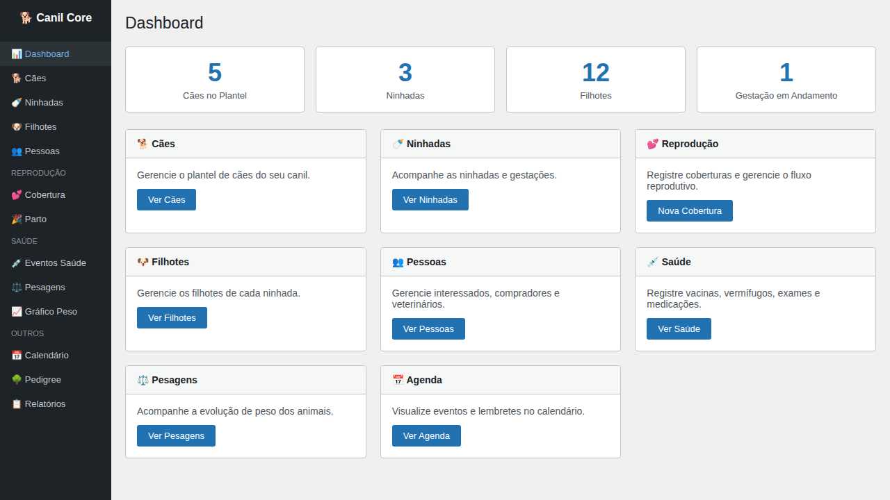
*Tela inicial com estatísticas do canil e acesso rápido às funcionalidades.*

---

## 🐕 Gestão de Cães

### Lista de Cães
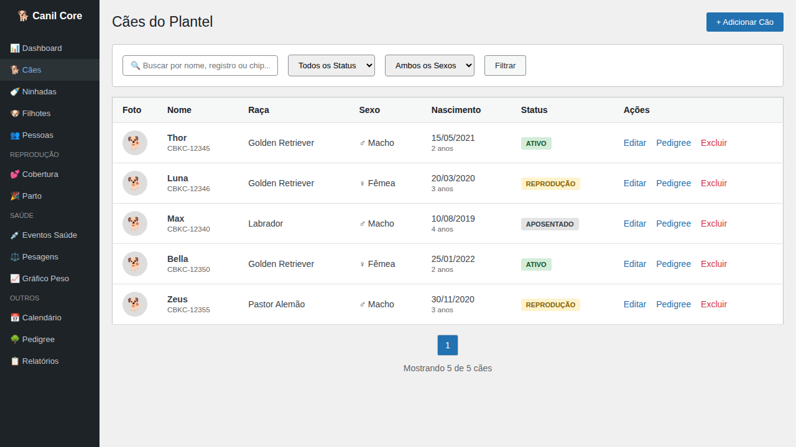
*Listagem do plantel com filtros por status e sexo.*

### Formulário de Cão
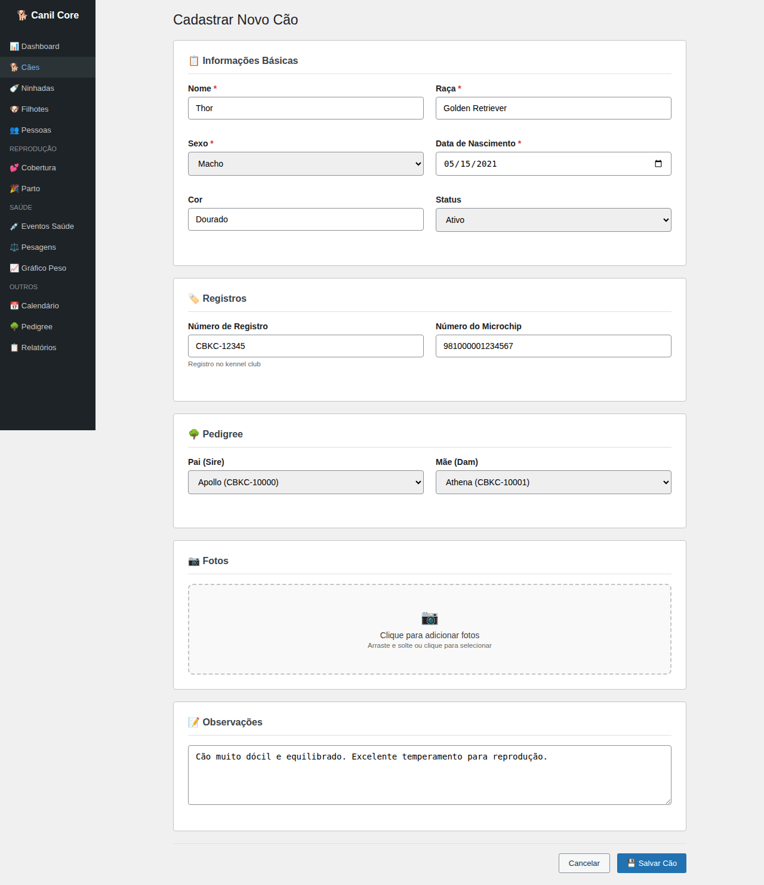
*Cadastro completo de cão com informações básicas, registros e pedigree.*

---

## 🍼 Gestão de Ninhadas

### Lista de Ninhadas
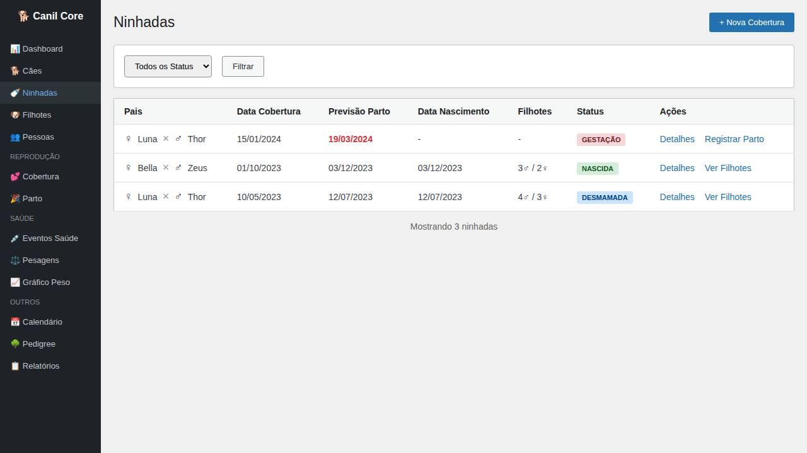
*Acompanhamento de ninhadas com status de gestação e parto.*

---

## 🐶 Gestão de Filhotes

### Lista de Filhotes
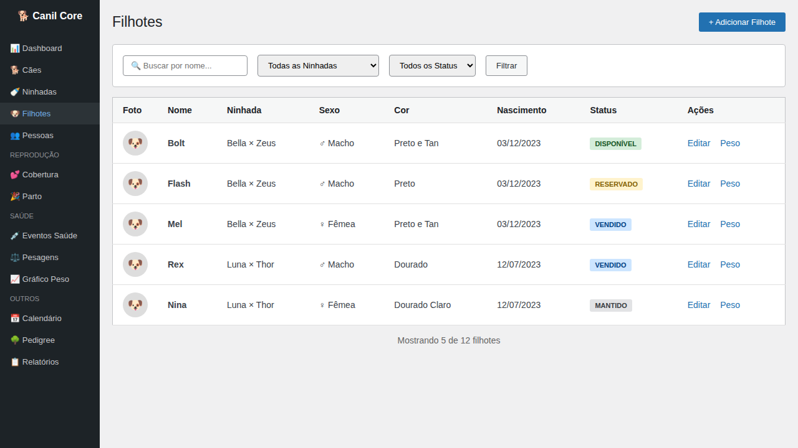
*Listagem de filhotes com status (disponível, reservado, vendido, mantido).*

---

## 💕 Reprodução

### Registrar Cobertura
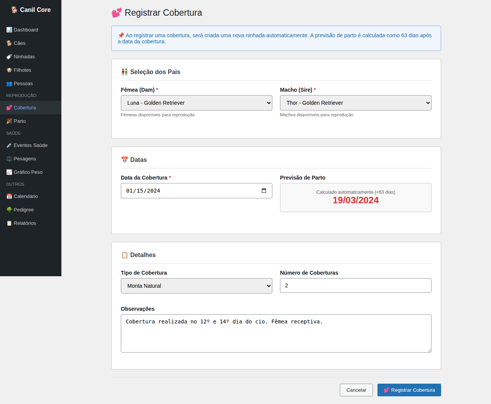
*Formulário para registrar cobertura com cálculo automático de previsão de parto.*

### Registrar Parto
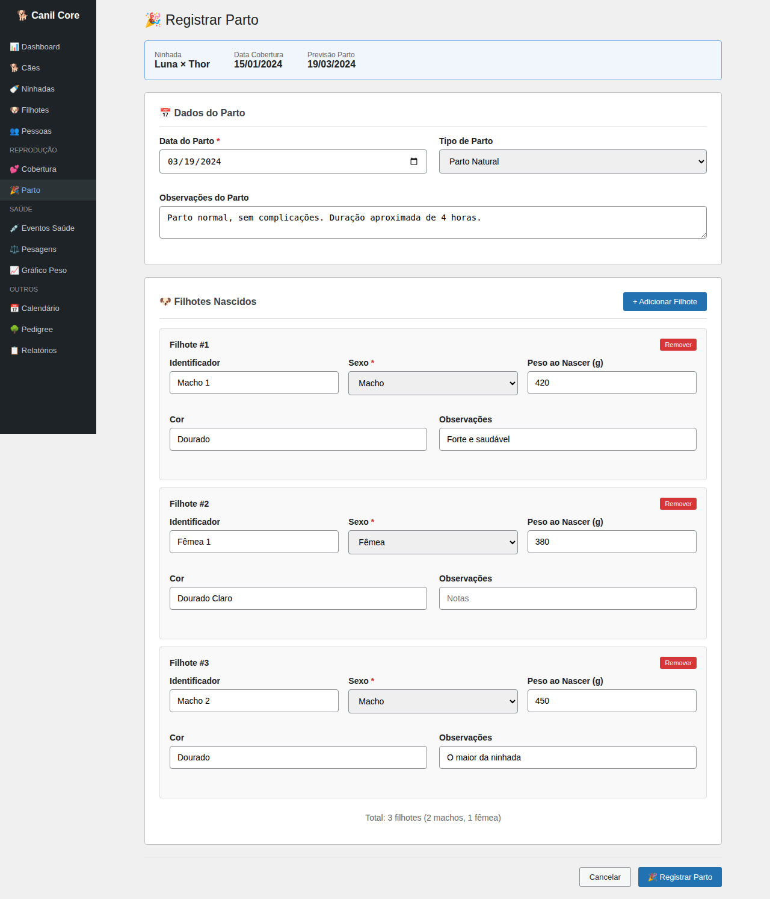
*Registro de parto com adição dinâmica de filhotes nascidos.*

---

## 💉 Saúde

### Eventos de Saúde
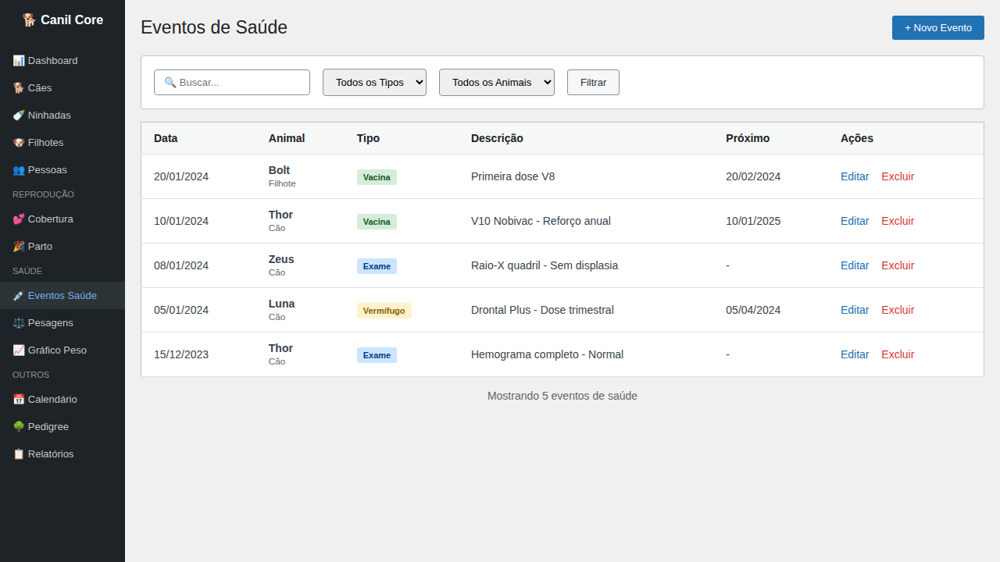
*Histórico de vacinas, vermífugos, exames e medicações.*

---

## ⚖️ Pesagens

### Gráfico de Evolução de Peso
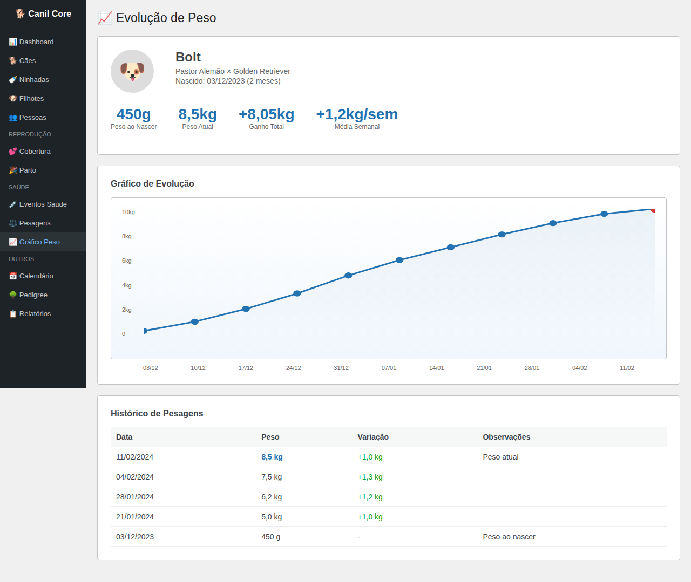
*Visualização gráfica da evolução de peso com histórico detalhado.*

### Pesagem em Lote
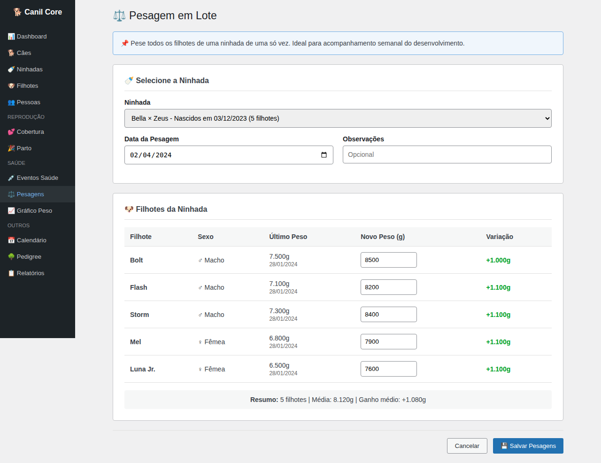
*Pesagem de todos os filhotes de uma ninhada de uma só vez.*

---

## 📅 Calendário

### Agenda do Canil
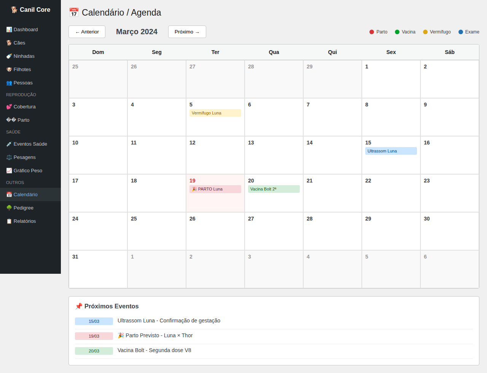
*Visualização mensal com eventos de parto, vacinas e lembretes.*

---

## 🌳 Pedigree

### Árvore Genealógica
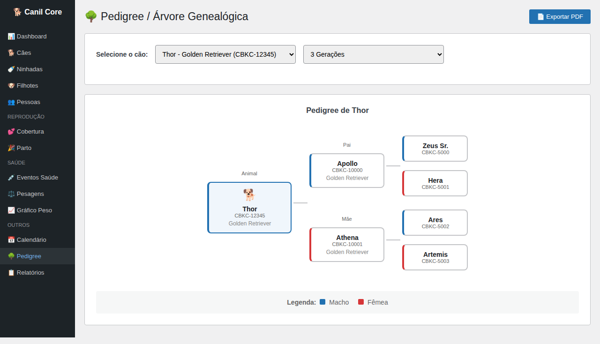
*Visualização do pedigree com até 5 gerações.*

---

## 📋 Relatórios

### Central de Relatórios
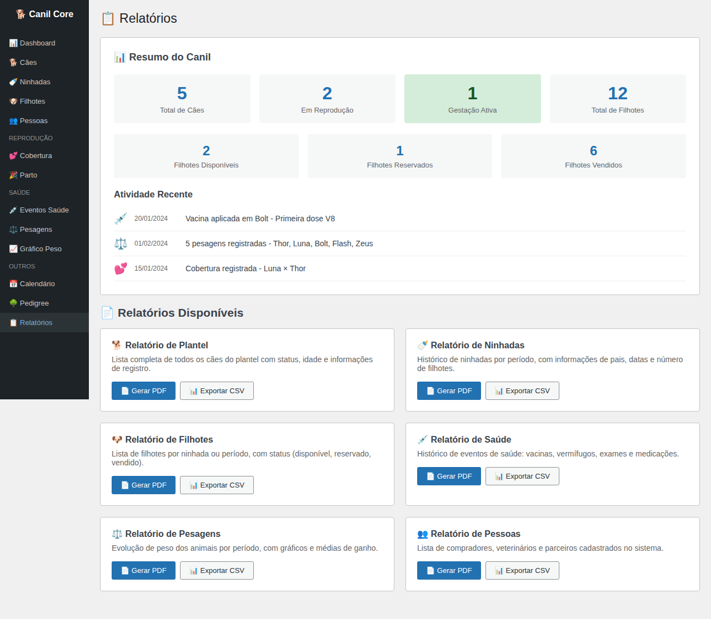
*Resumo do canil e geração de relatórios em PDF/CSV.*

---

## 👥 Pessoas

### Gestão de Pessoas
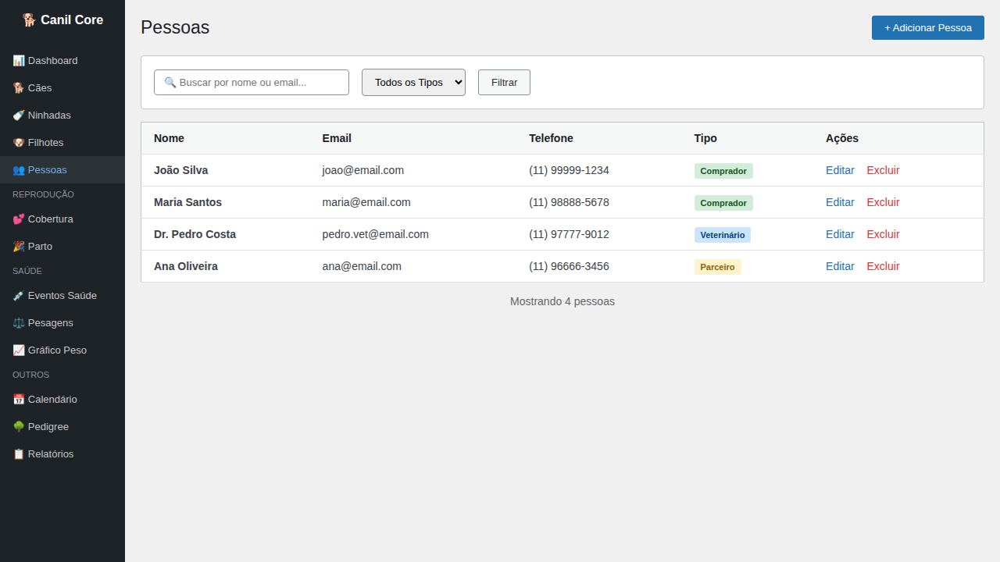
*Cadastro de compradores, veterinários e parceiros.*

---

## Funcionalidades Implementadas

### Fase 0 - Fundação ✅
- [x] Estrutura do repositório
- [x] Plugin skeleton (WordPress)
- [x] Configuração de build (Webpack/React)
- [x] Documentação base

### Fase 1 - Tenancy + Modelo de Dados ✅
- [x] Sistema de migrações
- [x] Tabelas do banco de dados
- [x] Camada base de repositórios (multi-tenant)
- [x] Roles e capabilities

### Fase 2 - REST API + Admin UI ✅
- [x] Controllers REST (Dogs, Litters, Puppies, People, Events)
- [x] Schemas e validação
- [x] Paginação e filtros
- [x] Admin UI em React com todas as páginas CRUD

### Fase 3 - Reprodução ✅
- [x] Workflow de reprodução (cio → cobertura → gestação → parto)
- [x] Integração Ninhada-Eventos
- [x] Registro de nascimento
- [x] Timeline por animal

### Fase 4 - Saúde + Pesagens + Agenda ✅
- [x] Eventos de saúde (vacina, vermífugo, exame, medicação)
- [x] Sistema de pesagens com gráficos
- [x] Pesagem em lote
- [x] Calendário/agenda

### Fase 5 - Pedigree + Relatórios ✅
- [x] Visualização de pedigree (3-5 gerações)
- [x] Relatórios essenciais
- [x] Exportação PDF/CSV

---

*Screenshots geradas em: 02/02/2026*
